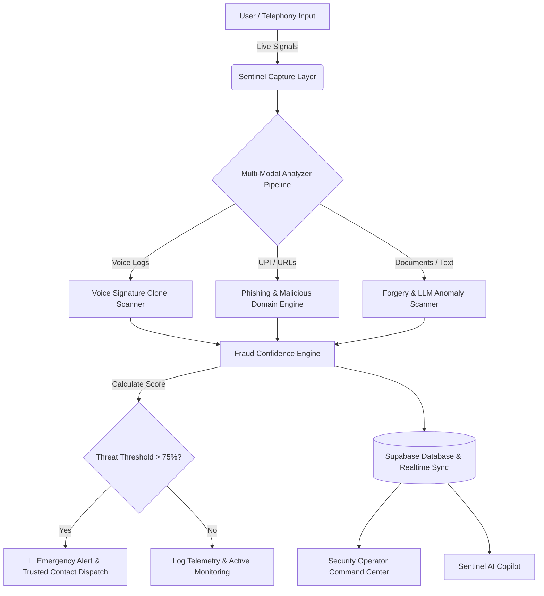

# Sentinel AI 🛡️

> **Next-Generation Real-Time Intelligent Security & Scam Defense Matrix**

[](https://nextjs.org/)
[](https://react.dev/)
[](https://www.typescriptlang.org/)
[](https://tailwindcss.com/)
[](https://supabase.com/)
[](LICENSE)

---

## 📌 Executive Summary

**Sentinel AI** is an advanced, multi-modal cyber defense platform designed to protect individuals and organizations from modern AI-driven financial fraud, vishing (voice cloning scams), QR code spoofs, malicious UPI phishing redirects, and document forgery.

Operating with zero-friction background telemetry, Sentinel AI continuously monitors incoming interactions, analyzes suspect payloads using LLM reasoning (powered by Grok AI), calculates real-time **Fraud Confidence Indices**, and automatically orchestrates emergency escalation protocols.

---

## ✨ Key Features & Capabilities

| Feature Module | Capabilities & Functionality |
| :--- | :--- |
| **🎙️ Real-Time Telephony Vishing Shield** | Active telephony capture monitoring, voice print signature cloning detection (e.g., CBI extortion templates), and live call overlay alerts. |
| **🔍 Multi-Modal AI Analyzer** | Deep-scan engines for **Chat & SMS**, **Voice Audio**, **Phishing URLs**, **Malicious QR Codes**, and **Forged Documents/Invoices**. |
| **📊 Fraud Confidence Engine** | Dynamic 0–100 risk scoring algorithm aggregating anomaly signals, structural heuristics, and explainable AI indicators. |
| **🚨 Emergency SOS & Alert Sync** | One-tap emergency escalation that instantly dispatches alerts to verified trusted contacts and logs high-priority threat cases. |
| **🤖 Sentinel AI Security Copilot** | Interactive conversational assistant that ingests multi-file evidence (images, audio, logs) and provides real-time threat intelligence. |
| **🎛️ Operations Command Center** | Enterprise dashboard for security operators featuring live incident queues, threat maps, node health tracking, and investigation triage. |
| **🎨 Glassmorphism Cyber UI** | Modern design system built with custom light/dark theme tokens, animated visualizers, and responsive layout primitives. |

---

## 🏗️ System Architecture



---

## 🛠️ Technology Stack

* **Framework**: Next.js 16 (App Router with Turbopack) & React 19
* **Language**: TypeScript (Strict Mode)
* **Styling**: Tailwind CSS v4 with custom design tokens (`@theme inline`)
* **State Management**: Zustand with persistent storage
* **Icons & Animation**: Lucide React, Framer Motion, custom CSS micro-animations
* **Data Visualization**: Recharts
* **Database & Auth**: Supabase (PostgreSQL, Auth, RLS Policies, Realtime)
* **AI Intelligence**: Grok (xAI) API & Custom Heuristic Extraction Pipelines

---

## 📁 Repository Structure

```text
c:\Prototype\
├── src/
│   ├── app/                        # Next.js 16 App Router pages
│   │   ├── assistant/              # AI Copilot chatbot page
│   │   ├── command-center/         # Security operations & incident triage
│   │   ├── dashboard/              # Main protection telemetry dashboard
│   │   ├── emergency/              # Emergency SOS & threat escalation
│   │   ├── login/ & register/      # Authentication pages with offline fallback
│   │   ├── monitoring/             # Real-time telephony & call inspection
│   │   ├── profile/                # User profile & trusted contacts management
│   │   ├── protection/             # Deep-scan analysis modules ([type])
│   │   ├── setup/                  # First-time onboarding wizard
│   │   ├── globals.css             # Core CSS tokens & Tailwind v4 config
│   │   └── page.tsx                # Welcome landing page
│   ├── components/                 # Reusable UI components
│   │   ├── AudioWaveform.tsx       # Real-time voice frequency visualizer
│   │   ├── BottomNavigation.tsx    # Mobile & desktop navigation bar
│   │   ├── CallOverlay.tsx         # Active vishing intercept overlay
│   │   ├── FraudConfidenceEngine.tsx # Risk score meter component
│   │   └── Providers.tsx           # Global state & query providers
│   ├── lib/
│   │   ├── services/               # AI engines, pipelines, & stats collectors
│   │   ├── store.ts                # Zustand global state store
│   │   └── supabase.ts             # Resilient Supabase client with mock fallback
│   └── theme/                      # Custom theme tokens (light/dark)
├── supabase/                       # SQL migrations & database schemas
└── package.json                    # Dependencies & scripts
```

---

## 🚀 Quickstart Guide

### Prerequisites
* **Node.js**: v18.17.0 or higher
* **npm**: v9.0.0 or higher

### 1. Clone the Repository
```bash
git clone https://github.com/FuryFox55/SentinelAI.git
cd SentinelAI
```

### 2. Install Dependencies
```bash
npm install
```

### 3. Configure Environment Variables
Create a `.env.local` file in the root directory:

```env
# Supabase Configuration
NEXT_PUBLIC_SUPABASE_URL=https://your-supabase-project.supabase.co
NEXT_PUBLIC_SUPABASE_ANON_KEY=your-supabase-anon-key

# Grok (xAI) API Key for Real-Time AI Threat Scanning
GROK_API_KEY=your-grok-api-key
```

> **Note**: If Supabase environment variables are omitted or offline, Sentinel AI automatically runs in **Resilient Offline Fallback Mode** using an in-memory database and mock auth for instant development and testing.

### 4. Run Development Server
```bash
npm run dev
```

Open [http://localhost:3000](http://localhost:3000) in your browser.

---

## 🧪 Verification & Quality Control

To run type checks and verify code formatting across the repository:

```bash
# Run TypeScript type check
npx tsc --noEmit

# Run ESLint validation
npm run lint
```

---

## 📄 Database Migrations

Database schemas and RLS policies are available under `supabase/migrations/`:
* `20260720043000_production_architecture.sql`: Core tables (`user_profiles`, `trusted_contacts`, `threat_events`, `analysis_reports`, `notifications`).
* `20260721000000_auth_auto_confirm.sql`: Development helper triggers for automatic account confirmation.

---

## 📜 License

Distributed under the **MIT License**. See `LICENSE` for more details.

---

## 👤 Author

Developed by **[Sai Ram (FuryFox55)](https://github.com/FuryFox55)**.
